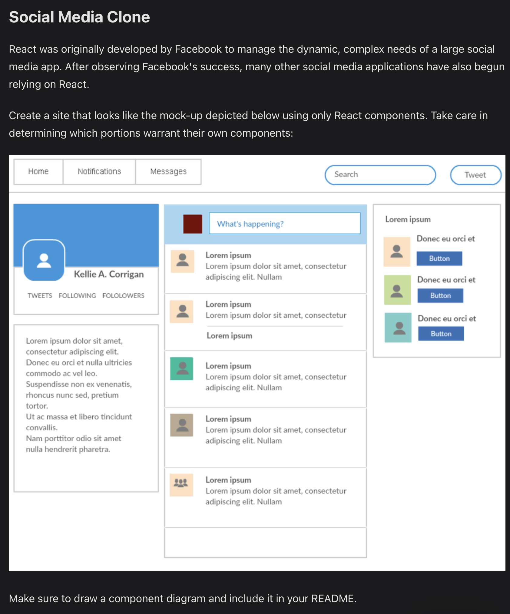
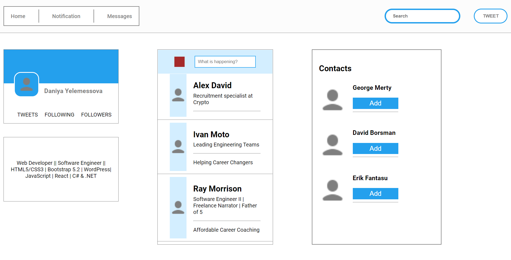

# Social media Clone

by Daniya Yelemessova

## Description

- This is an in-class exercise within the React Fundamentals course offered by Epicodus. 

## Practice picture

### 
  

## Screenshort

### 
  

## 
 📬 _Contact Information_

#### For any questions _[LinkedIn](https://www.linkedin.com/in/daniya-collings/)_

## 
 📘 _License and copyright:_

> **_© Daniya Yelemessova, 2023_**  
> ⚖️ __
